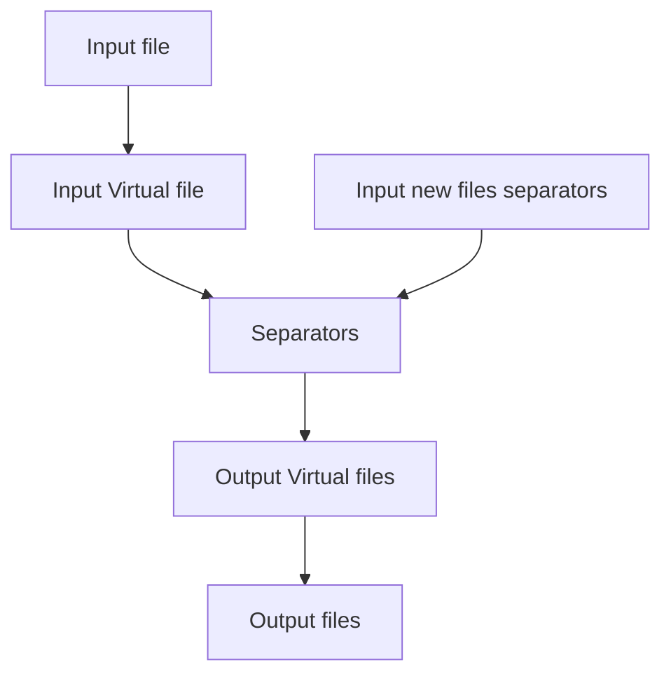

# Design
- Separators define the start of a file and are included in it.
- Pattern matching uses REGEX and can be multiline.
    - Files need to be processable as a long string. A list of lines approach won't work for this situation.
- Pattern replacement uses repl syntax form regex.

## Modularize
Each operation should be configurable and flexible on its own.
### Text processor operations
- Find Matchings
- Replace matching in text
    - Replace matching group
    - With input
- Line iterator
- Split at positions

### File processor operations
- Split files with search matchings.
    - Start line of word.
    - Name the result with strategies:
        - Ascending numbers (0, 1, 2, 3)
        - Match group
        - Line number
        - Search config number (from order) 5_1 (1st file of regex 5)
- Replace matching in filename

Maybe:
- Get search matchings in file.
    - Get group of matchings in file.
- Match in filename

## Workflow for sample use case

