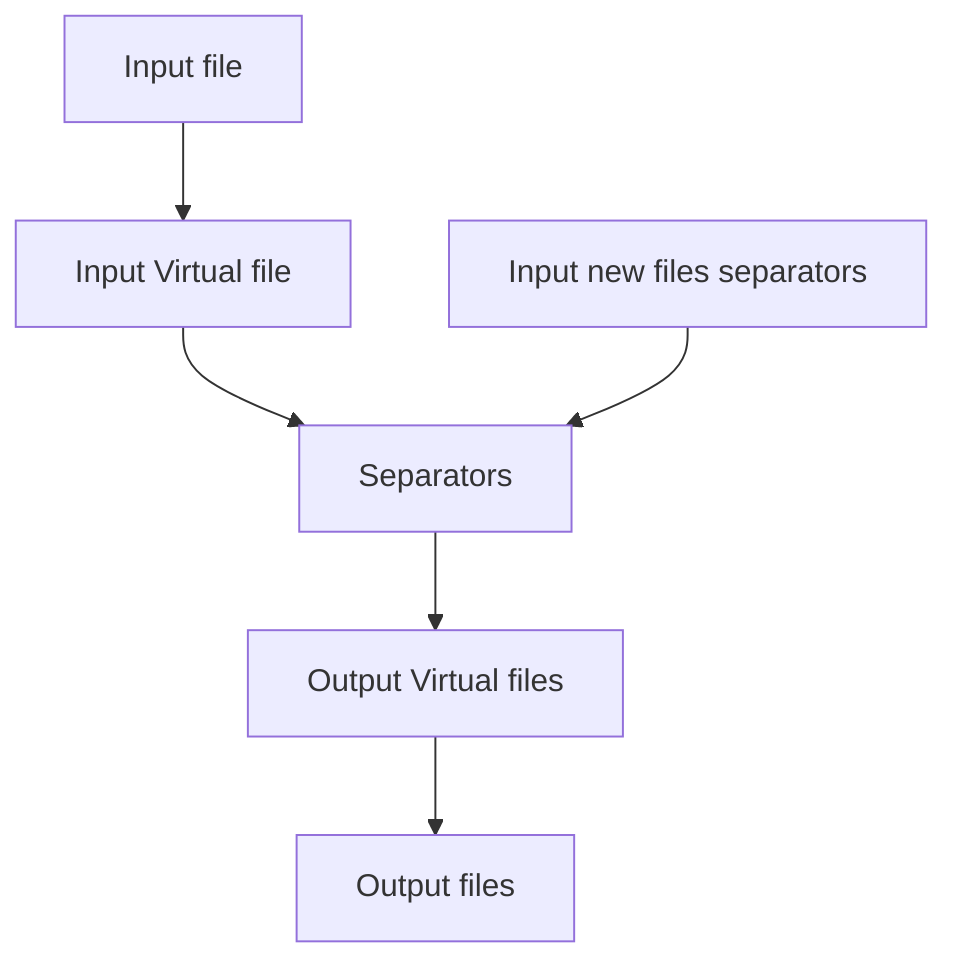

```mermaid
graph TD;
INPUT1[Input file]
INPUT2[Input new files separators]

VFILE[Input Virtual file]
SEPARATORS[Separators]

OUTPUT[Output files]
VFILES[Output Virtual files]

INPUT1 --> VFILE
VFILE --> SEPARATORS
SEPARATORS --> VFILES
VFILES --> OUTPUT

INPUT2 --> SEPARATORS

```